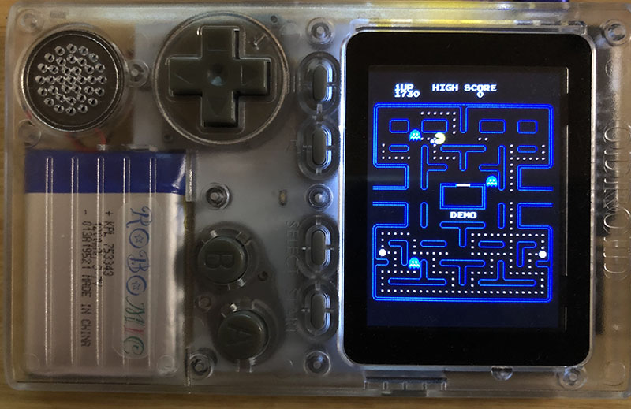

# Pacman for Odroid-GO & M5Stack

### Modified by Micutil

- Modified sketch for Odroid-GO ([using ESP32-Chimera-Core](https://github.com/tobozo/ESP32-Chimera-Core)).
- Added binary for Odroid-GO

### Copy the built binnary progurams to microSD

- Copy the files in the microSD folder to the root of microSD.
- Set the microSD into Odroid-GO
- Select and launche the program with LovyanLauncher.
- For the original Odroid-GO firmware, no launcher is needed. Switch on with the B button pressed, select the program and launch it. It is necessary to turn the switch on again after startup.

### Programs
- in OG_Gamebin ... Arduino program for Odroid-GO
- in odroid/firmwares ... fw file for Odroid-GO

### Control with Odroid-GO

- Start: A button (Upper left side).
- Start: B button (Upper right side).
- Move pacman: Cross key

-------------------------
### Original READ ME

A fork from [MhageGH/esp32_ILI9328_Pacman](https://github.com/MhageGH/esp32_ILI9328_Pacman) focused on [M5Stack SD Menu Loader](https://github.com/tobozo/M5Stack-SD-Updater) support.

## Development Environment
- [Arduino IDE](https://www.arduino.cc/en/main/software)
- [arduino-esp32](https://github.com/espressif/arduino-esp32)

## Coding reference
- [Macsbug tutorial](https://macsbug.wordpress.com/2018/03/07/pacman-with-m5stack/)
- [Pacman-Arduino-Due](https://github.com/DrNCXCortex/Pacman-Arduino-Due)
- [MhageGH/esp32_ILI9328_Pacman](https://github.com/MhageGH/esp32_ILI9328_Pacman)

## Controller
This is an implementation of a PSP Joypad using pins 35 and 36.
All other controls have been disabled.

